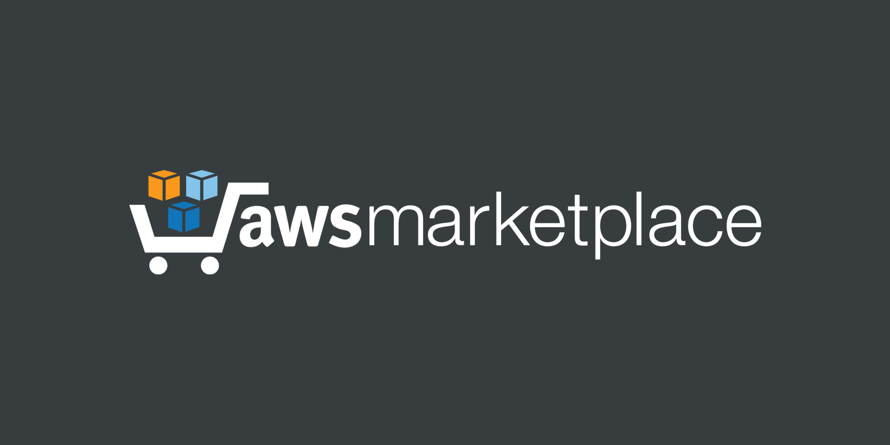
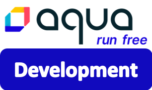

<a href="#"></a>

# Aqua Enterprise platform for EKS
Launch Aqua Enterprise platform in a new cluster or an existing cluster to secure your cloud-native workloads at any scale. Equipped with the most powerful vulnerability scanner in the market, we provide cloud-native life-cycle security across the technology stack. Secure your builds, infrastructure and workloads rapidly and across AWS Regions and Availability Zones, providing a single pane of glass experience across multiple environments, with broad support for VMs, containers and serverless workloads of both Linux and Windows flavors.

## Overview
Aqua Enterprise platform can be deployed on an existing EKS cluster or you can use ```eksctl``` to create a new one following the instructions. The Aqua deployment is facilitated via Helm charts for a quick and easy push-button deployment.


## Step 1: Subscribe on the AWS Marketplace
Before launching one of our products, you'll first need to subscribe to Aqua enterprise platform on the <a target="_blank" href="https://aws.amazon.com/marketplace/pp/B07KJKMNR8">AWS Marketplace.</a> Click the button below to get started: 
<table>
	<tr>
		<td></td>
	</tr>
</table>
<table>
	<tr>
		<td width="40%"><a target="_blank" href="https://aws.amazon.com/marketplace/pp/B07KJKMNR8"></a></td>
		<td>
			<h3>Aqua Enterprise platform on AWS Marketplace</h3>
			<p>Subscribe now and check out our 30-day FREE TRIAL to secure the environment of your choosing TODAY!!
			</p>
			<p align="right"><a target="_blank" href="https://aws.amazon.com/marketplace/pp/B07KJKMNR8"></a></p>
		</td>
	</tr> 
</table>

## Step 2: Pre-requisites
Launch the script as a sanity check for pre-requisites. This is a list of tools to make your life easy while working with Amazon EKS and deploying the Aqua platform with an easy push-button experience. These include kubectl, awscli, eksctl and helm.

```bash
wget https://aqua-security-public.s3.amazonaws.com/install_prereq.sh
chmod +x install_prereq.sh

# Check out the Help menu
./install_prereq.sh -h

# Perform a sanity check for pre-requisite tools
./install_prereq.sh -t
```

## Step 3: Launch Aqua enterprise platform for EKS via Helm
Architected as a microservices application for self-hosting, the Aqua platform is outputted as containers in the form of Kubernetes-native deployments, tailored using Helm charts. 

Before you begin, pick a deployment scenario below that best suits your needs.

### Aqua platform for Development
<table>
	<tr>
		<td width="25%"><a href="pages/aqua-in-a-box.md"></a></td>
		<td>
			<h3>Aqua in a box</h3>
			<p>Launch Aqua platform in a new or existing EKS cluster and secure your artifacts, hosts and workloads with Aqua. Well-suited for non-production deployments, it allows you to hit the ground running while providing a sneak peak int Aqua's full-blown cloud-native security capabilities. </p>
			<p align="right"><a href="pages/aqua-in-a-box.md"></a></p>
		</td>
	</tr>
</table>

### Aqua Enterpise platform for Production
<table>
	<tr>
		<td width="25%"><a href="pages/aqua-for-production.md"></a></td>
		<td>
			<h3>Aqua platform for production-grade deployments</h3>
			<p>Launch Aqua platform in a new or existing EKS cluster with a enterprise-grade managed PostgreSQL RDS Database. Simplified deployment leveraging CloudFormation template and Helm Charts for a better customer experience. </p>
			<p align="right"><a href="pages/aqua-for-production.md"></a></p>
		</td>
	</tr>
</table>

To learn more...check out our blog on the APN channel regarding [Implementing DevSecOps on Amazon EKS](https://aws.amazon.com/blogs/apn/deploying-devsecops-on-amazon-eks-with-aqua-security-part-1/)

## Support
If you encounter any problems, or would like to give us feedback, please contact cloud support at [Cloud Sales](mailto:cloudsupport@aquasec.com). 

We also encourage you to raise issues here on GitHub. Please contact us at https://github.com/aquasecurity.

---
Visit [aquasec.com](https://www.aquasec.com/) to learn more.