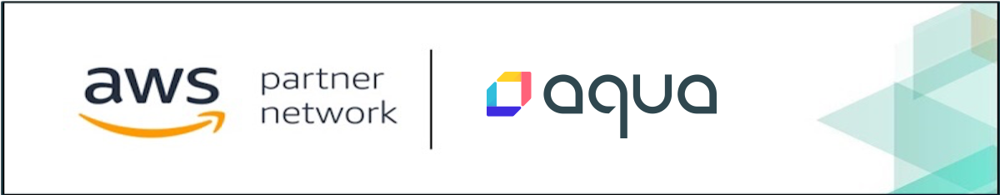
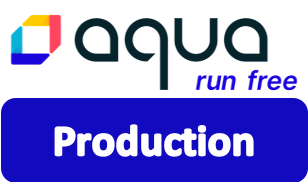

<a href="#"></a>

# Aqua Enterprise platform for EKS
We strive to provide a single pane of glass experience across multiple environments, with broad support for VMs, containers and serverless workloads of both Linux and Windows flavors. Equipped with the most powerful vulnerability scanner and innovative runtime enforcement techniques in the market, we provide cloud-native life-cycle security across the technology stack. 

## Overview
Aqua Enterprise platform can be deployed on an existing EKS cluster or you can use ```eksctl``` to create a new one following the instructions. We provide Helm charts for a quick and easy push-button deployment.


## Step 1: Subscribe on the AWS Marketplace
Subscribe to Aqua Enterprise platform on the <a target="_blank" href="https://aws.amazon.com/marketplace/pp/B07KJKMNR8">AWS Marketplace.</a> Click the button below to get started: 
<table>
	<tr>
		<td></td>
	</tr>
</table>
<table>
	<tr>
		<td width="40%"><a target="_blank" href="https://aws.amazon.com/marketplace/pp/B07KJKMNR8"></a></td>
		<td>
			<h3>Aqua Enterprise platform on AWS Marketplace</h3>
			<p>Subscribe now and check out our 30-day FREE TRIAL to secure the environment of your choosing TODAY!!
			</p>
			<p align="right"><a target="_blank" href="https://aws.amazon.com/marketplace/pp/B07KJKMNR8"></a></p>
		</td>
	</tr> 
</table>

## Step 2: Pre-requisites
Make sure you have these tools installed to make your life easy while working with Amazon EKS and deploying our platform with an easy push-button experience. 
The list includes:
* [kubectl](https://docs.aws.amazon.com/eks/latest/userguide/install-kubectl.html)
* [awscli](https://docs.aws.amazon.com/cli/latest/userguide/install-cliv2.html)
* [eksctl](https://docs.aws.amazon.com/eks/latest/userguide/getting-started-eksctl.html#install-eksctl)
* [helm](https://helm.sh/docs/intro/install/)

Also [configure your AWS credentials](https://docs.aws.amazon.com/cli/latest/userguide/cli-configure-quickstart.html) locally using `aws configure` to access your AWS resources.


## Step 3: Launch Aqua enterprise platform for EKS via Helm
Architected as a microservices application, the Aqua platform is outputted as containers in the form of Kubernetes-native deployments. Before you begin, pick a deployment scenario below that best suits your needs.

### Aqua platform for Development
<table>
	<tr>
		<td width="25%"><a href="pages/aqua-in-a-box.md"></a></td>
		<td>
			<h3>Aqua in a box</h3>
			<p>This scenario is well-suited for non-production deployments and allows you to hit the ground running while providing a sneak peak int Aqua's full-blown cloud-native security capabilities. </p>
			<p align="right"><a href="pages/aqua-in-a-box.md"></a></p>
		</td>
	</tr>
</table>

### Aqua Enterpise platform for Production
<table>
	<tr>
		<td width="25%"><a href="pages/aqua-for-production.md"></a></td>
		<td>
			<h3>Aqua platform for production-grade deployments</h3>
			<p>This scenario provisions an enterprise-grade managed PostgreSQL RDS Database with simplified deployment leveraging CloudFormation template and Helm Charts for a better customer experience. </p>
			<p align="right"><a href="pages/aqua-for-production.md"></a></p>
		</td>
	</tr>
</table>

To learn more...check out our blog on the APN channel regarding [Implementing DevSecOps on Amazon EKS](https://aws.amazon.com/blogs/apn/deploying-devsecops-on-amazon-eks-with-aqua-security-part-1/)

## Support
If you encounter any problems, or would like to give us feedback, please contact cloud support at [Cloud Sales](mailto:cloudsupport@aquasec.com). 

We also encourage you to raise issues here on GitHub. Please contact us at https://github.com/aquasecurity.

---
Visit [aquasec.com](https://www.aquasec.com/) to learn more.