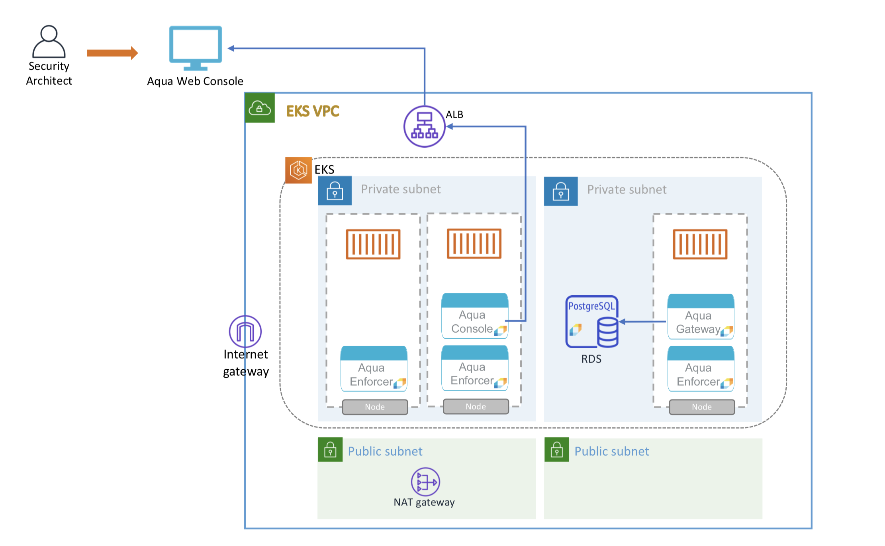
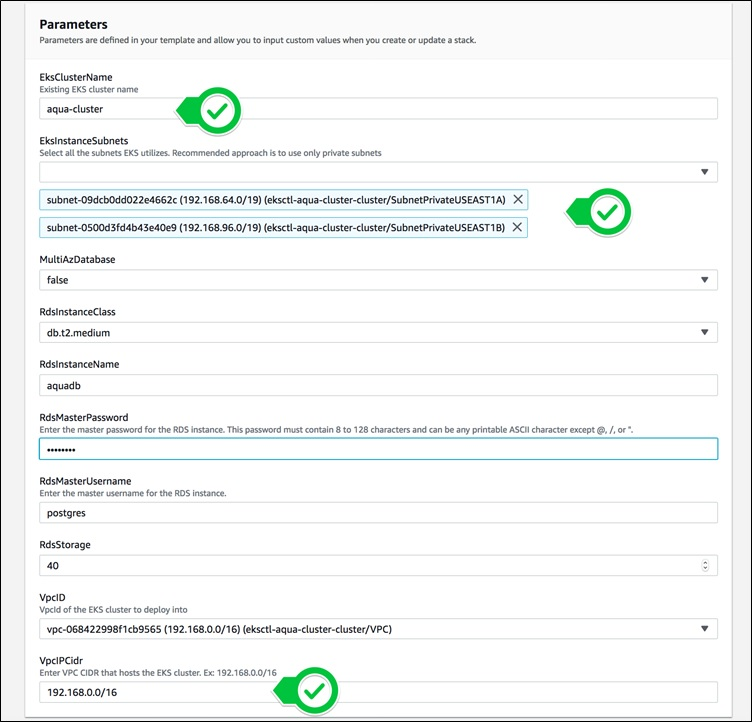
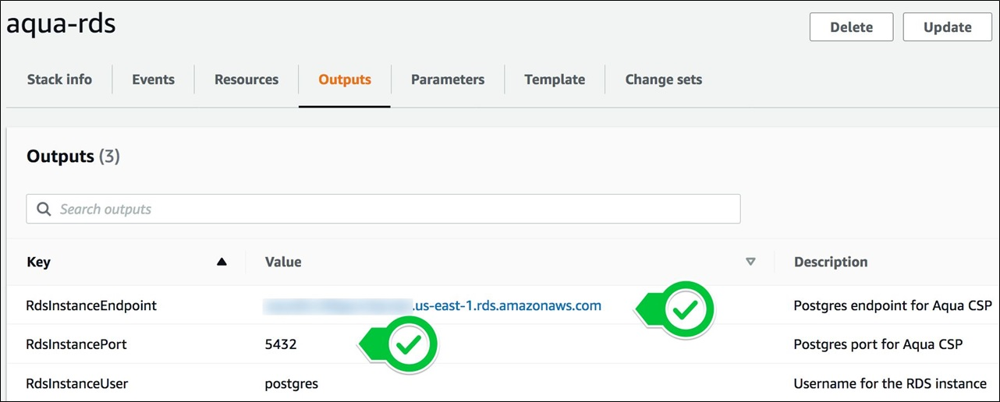
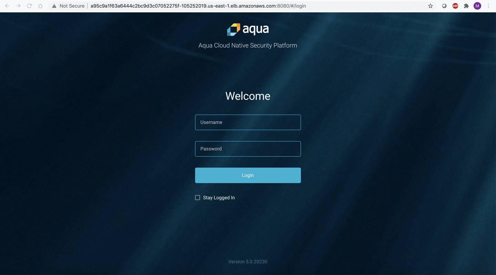

# Launch Aqua platform for production-ready EKS environment

## Overview
A <b><i>production-grade</i></b> Aqua platform deployment requires a <b>managed Postgres database</b> installation like Amazon RDS. This is a highly scalable and resilient architecture recommended for production workloads.

Just follow these <b>5 SIMPLE STEPS</b> to get up and running.


## Step 1: Configure Your EKS cluster
Aqua can easily be launched into an existing EKS environment or you can [spin up a new one](#create-a-new-EKS-cluster). using [https://eksctl.io/]. 
<br>

Configure the kubeconfig file for your EKS cluster on your local machine.
```shell
eksctl utils write-kubeconfig --cluster=<name> [--kubeconfig=<path>][--profile=<profile>][--set-kubeconfig-context=<bool>]
```

Verify the node status
```shell
kubectl get nodes
```

## Step 2: Create Amazon RDS Postgres database
Aqua recommends implementing a dedicated managed database like Amazon RDS for an enterprise-grade experience. 
<table>
	<tr>
		<td width="35%"><p align="center"></a></p></td>
		<td>
			<h3>Amazon RDS for Aqua platform</h3>
			<p>Launch the CloudFormation stack to deploy an Amazon RDS database in the same VPC as your EKS cluster. 
			</p>
			<p align="right"><a href="https://console.aws.amazon.com/cloudformation/home?#/stacks/new?stackName=aqua-rds&templateURL=https://aqua-security-public.s3.amazonaws.com/AquaRDS.yaml"></a></p>
		</td>
	</tr>
</table> 

### CloudFormation Stack parameters
<table>
	<tr>
		<td></td>
	</tr>
</table>

### CloudFormation Stack output
<table>
	<tr>
		<td></td>
	</tr>
</table>

## Step 3: Create a Service account with EKS IAM permissions
This command helps you set up the required <b>IAM permissions</b> required by Aqua Platform to run smoothly on Amazon EKS.
```shell
eksctl utils associate-iam-oidc-provider --cluster=<cluster_name> --approve [--profile=<profile>]
eksctl create iamserviceaccount --name aqua-sa --namespace aqua --cluster <cluster_name> --attach-policy-arn arn:aws:iam::aws:policy/AWSMarketplaceMeteringRegisterUsage --approve [--profile <profile>]
```

## Step 3: Deploy the Aqua Enterprise platform
You can retrieve the Helm chart from the ECR repository.
```shell
export HELM_EXPERIMENTAL_OCI=1

aws ecr get-login-password \
	--region us-east-1 | helm registry login \
	--username AWS \
	--password-stdin 709825985650.dkr.ecr.us-east-1.amazonaws.com

helm chart pull 709825985650.dkr.ecr.us-east-1.amazonaws.com/aqua-security-software/aqua-helm:5.3.0

helm chart export 709825985650.dkr.ecr.us-east-1.amazonaws.com/aqua-security-software/aqua-helm:5.3.0 --destination ./charts
```

Install the Aqua Helm chart:
```shell
helm install csp --namespace aqua ./charts/aqua \
			--set global.imageTag="5.3.21062" 
			--set global.awsRegion=<aws_region_for_eks> 
			--set global.ExternalDB="enabled" \
			--set global.ExternalDBHost=<rds_endpoint> \
			--set global.dbExternalPassword=<db_password> \ 
			--set global.aquaPassword=<admin_password>
```

## Step 5: Launch Aqua console
Obtain the Aqua console URL by running the following command
```shell
AQUA_CONSOLE=$(kubectl get svc csp-console-svc --namespace aqua -o jsonpath="{.status.loadBalancer.ingress[0].hostname}")
  
echo "http://$AQUA_CONSOLE:8080"
```

Please note the Aqua console URL above and navigate to the Aqua console in your favorite browser.
<table>
	<tr>
		<td></td>
	</tr>
</table>

If you already have one, input the Aqua license or obtain the license by filling out the form linked on the Aqua Console startup portal. You can simply reach out to us at [cloudsales@aquasec.com](mailto:cloudsales@aquasec.com) and we’ll create one for you.<br /><br />


## Appendix
### Create a new EKS cluster
Creation of an EKS cluster can be simplified using eksctl commands: [https://eksctl.io/].
<br>If you choose to use a separate EKS environment solely to host the Aqua Enterprise platform, then it is recommended that you create a <i><b>private nodegroup</b></i> in your EKS cluster and use a <b>NAT gateway</b> for communication.
<br>
>Please note that you will have to create an EC2 Keypair if SSH access is desired for the nodes.
```shell
eksctl create cluster --name aqua-cluster --region us-east-1 --zones us-east-1a,us-east-1b --nodegroup-name private-ng1 --nodes 2 --ssh-public-key <EC2_keypair> --node-private-networking --vpc-nat-mode HighlyAvailable
```
---
Visit [aquasec.com](https://www.aquasec.com/) to learn more.
