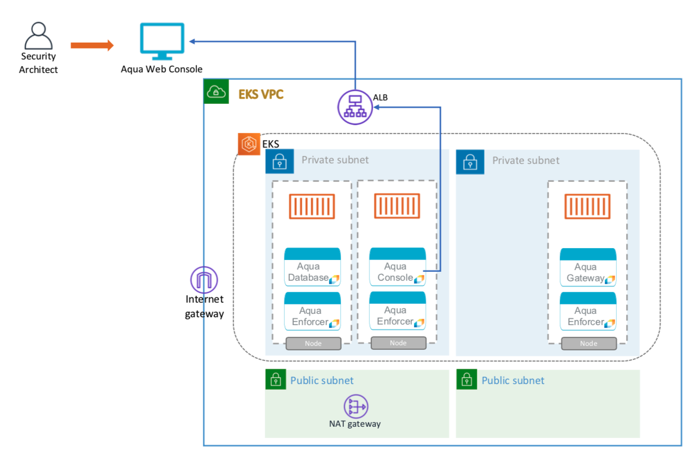

# Launch Aqua in a box for EKS

## Overview
This deployment scenario provides a <b><i>starter environment</b></i> that includes a <b>database container for Postgres</b>, leveraging a persistent volume to store data. This architecture is not scalable or resilient enough for production workloads, but extremely useful for evaluation.

Just follow these <b>4 SIMPLE STEPS</b> to get up and running.




## Step 1: Configure Your EKS cluster
Aqua can easily be launched into an existing EKS environment or you can [spin up a new one](#create-a-new-EKS-cluster). using [https://eksctl.io/]. 
<br>

Configure the kubeconfig file for your EKS cluster on your local machine.
```shell
eksctl utils write-kubeconfig --cluster=<name> [--kubeconfig=<path>][--profile=<profile>][--set-kubeconfig-context=<bool>] 
```

Verify the node status
```shell
kubectl get nodes
```

## Step 2: Create a Service account with EKS IAM permissions
Download and configure the [helper_script](../../../scripts/helper_script.sh). 

```shell
wget https://aqua-security-public.s3.amazonaws.com/helper_script.sh
```

Configure the script for the following parameters, by downloading and editing the file:

<table>
	<tr>
		<th width="23%"><strong>Parameter</strong></th>
        <th width="25%"><strong>Default value</strong></th>
		<th width="52%"><strong>Description</strong></th>
	</tr>
	<tr>
		<td>ClusterName</td>
        <td>aqua-cluster</td>
		<td>The name of your EKS Cluster. Please note, the name must be all lowercase.</td>
	</tr>
	<tr>
		<td>AWSRegion</td>
        <td>us-east-1</td>
		<td>The AWS Region of your EKS Cluster. Please note, the name must be all lowercase.</td>
	</tr>
	<tr>
		<td>ProfileName</td>
        <td>default</td>
		<td>The name of your AWS profile set in the local $HOME/.aws/config file used by AWS CLI. Please note, the name must be all lowercase.</td>
	</tr>
	<tr>
		<td>DBPassword</td>
        <td></td>
		<td>The password for the Aqua RDS Database for your deployment.</td>
	</tr>
	<tr>
		<td>AquaPassword</td>
        <td></td>
		<td>The administrator password for your Aqua Web Console.</td>
	</tr>
</table>

```shell
export CLUSTER_NAME='aqua-cluster'
export AWS_PROFILE='default'
export AWS_REGION='us-east-1'
export AQUA_PASSWORD=''

# This parameter has to be populated for containerized PostGres DB Deployment
export DB_PASSWORD=''

```

### Execute the script for IAM setup
This script helps you set up the required <b>IAM permissions</b> required by Aqua Platform to run smoothly on Amazon EKS. 
```shell
chmod +x helper_script.sh
./helper_script.sh init

```

## Step 3: Deploy the Aqua Enterprise platform

### Deploy using the helper_script

```shell
./helper_script.sh install_aqua
```

### Deploy using manual Helm commands
You can manually use Helm commands yourself.
```shell
wget https://aqua-security-public.s3.amazonaws.com/aqua.tar
tar -xvf aqua.tar

helm install --namespace aqua csp ./aqua \
			 --set global.awsRegion=<aws_region_for_eks> \
			 --set global.dbPassword=<db_password> \
			 --set global.aquaPassword=<aqua_password>
```
## Step 4: Launch Aqua console
Obtain the Aqua console URL by running the following command
```shell
AQUA_CONSOLE=$(kubectl get svc csp-console-svc --namespace aqua -o jsonpath="{.status.loadBalancer.ingress[0].hostname}")
  
ECHO "http://$AQUA_CONSOLE:8080"
```

Please note the Aqua console URL above and navigate to the Aqua console in your favorite browser.
<table>
	<tr>
		<td></td>
	</tr>
</table>

If you already have one, input the Aqua license or obtain the license by filling out the form linked on the Aqua Console startup portal. You can simply reach out to us at [cloudsales@aquasec.com](mailto:cloudsales@aquasec.com) and we’ll create one for you.<br /><br />

## Appendix
### Create a new EKS cluster
Creation of an EKS cluster can be simplified using eksctl commands: [https://eksctl.io/].
<br>If you choose to use a separate EKS environment solely to host the Aqua Enterprise platform, then it is recommended that you create a <i><b>private nodegroup</b></i> in your EKS cluster and use a <b>NAT gateway</b> for communication.
>Please note that you will have to create an EC2 Keypair if SSH access is desired for the nodes.
```shell
eksctl create cluster --name aqua-cluster --region us-east-1 --zones us-east-1a,us-east-1b --nodegroup-name private-ng1 --nodes 2 --ssh-public-key <EC2_keypair> --node-private-networking --vpc-nat-mode HighlyAvailable
```
---
Visit [aquasec.com](https://www.aquasec.com/) to learn more.