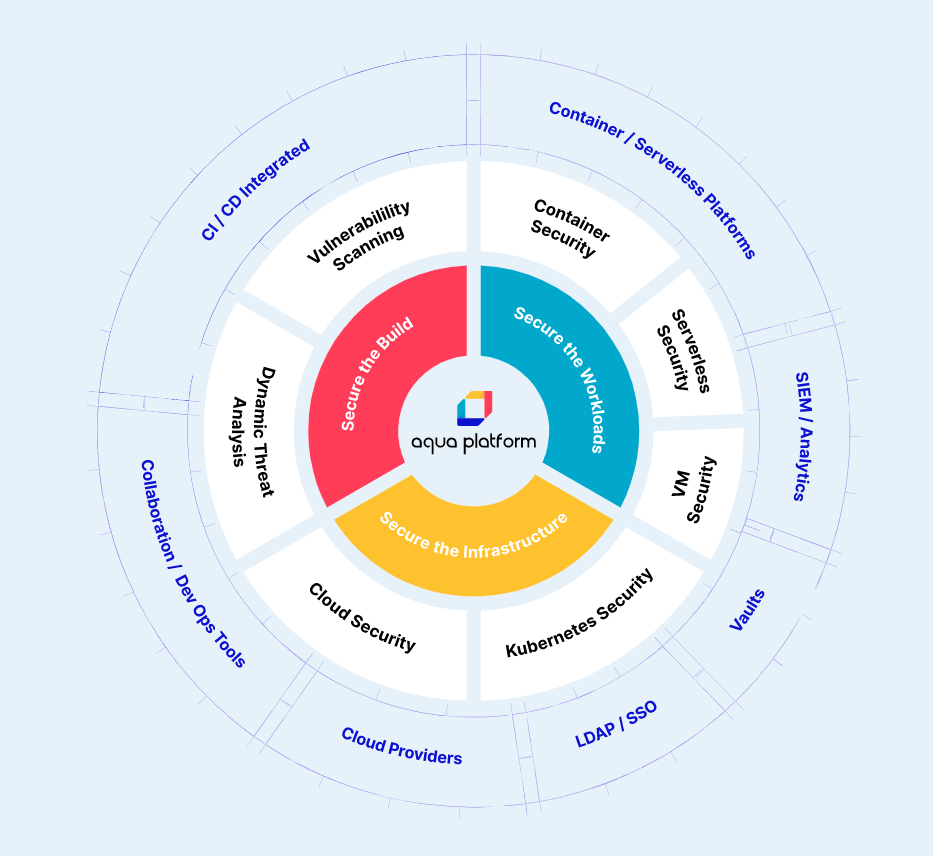

### Automating DevSecOps

<table>
	<tr>
		<td width="35%">
</td>
		<td>
			
<b>Shift left</b> security early into the DevOps pipeline, accelerating application delivery and removing obstacles to digital transformation.

			

		</td>
	</tr> 
</table>

### Modernize Security
<table>
	<tr>
		<td width="35%"></a></td>
		<td>
			
Ensure the flow of <b>good code</b> with application-aware controls while automatically detecting and preventing suspicious activity.

			

		</td>
	</tr>
</table>

### Enforcer regulatory compliance
<table>
	<tr>
		<td width="35%">

</td>
		<td>
			
Enforce regulatory compliance controls for PCI, HIPAA, GDPR, and beyond, across the cloud-native application lifecycle. 

			

		</td>
	</tr>
</table>

### Runtime Security enforcement
<table>
	<tr>
		<td width="35%">

</td>
		<td>
			
Enforces container immutability, automatically profile container behavior and segments workloads by automatically creating dynamic firewall rules between container services. 

			

		</td>
	</tr>
</table>

## Support
If you encounter any problems, or would like to give us feedback, please contact cloud support at [Cloud Sales](mailto:cloudsupport@aquasec.com). We also encourage you to raise issues here on GitHub. Please contact us at https://github.com/aquasecurity.

---
Visit [aquasec.com](https://www.aquasec.com/) to learn more.