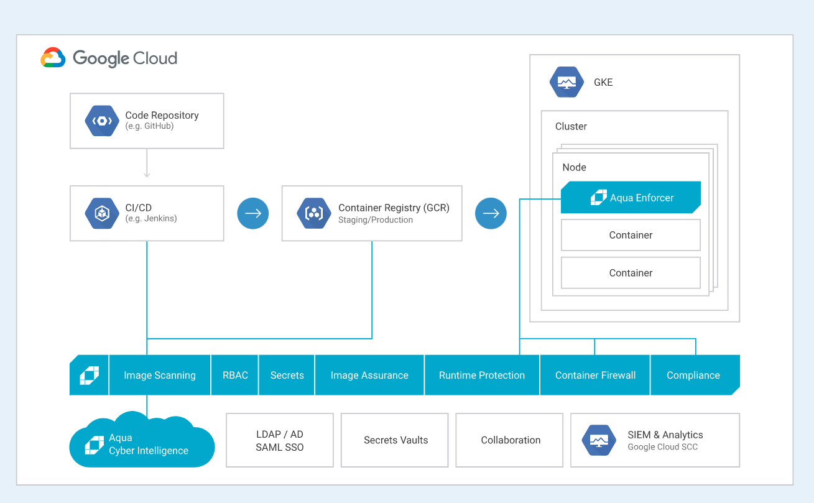
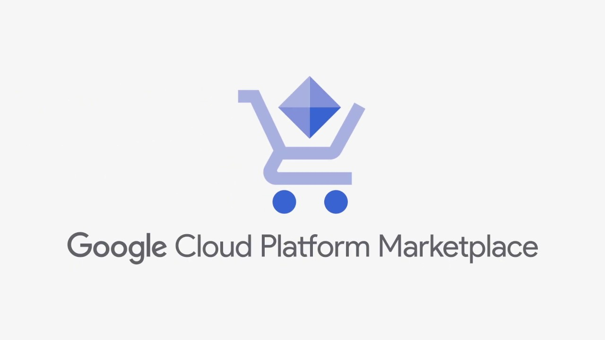
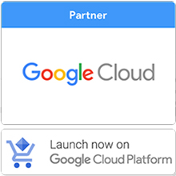
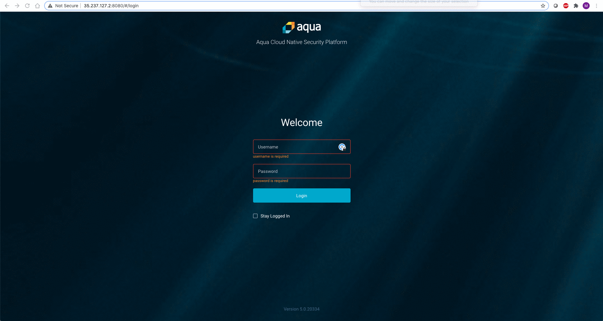

## Aqua for GCP Marketplace

>Note: For guidance on registering additional Aqua Enforcers for Google Cloud GKE, please refer to [this](pages/Registering-additional-enforcers.md)

## Step 1: Subscribe on the GCP Marketplace
Before launching one of our products, you'll first need to subscribe to Aqua enterprise platform on the <a href="https://console.cloud.google.com/marketplace/details/aquasecurity-public/aqua-security-payg?q=aqua&project=lexical-ellipse-195321">GCP Marketplace.</a> Click the button below to get started:

<table>
	<tr>
		<td width="40%"></td>
		<td>
			<h3>Aqua platform on GCP Marketplace</h3>
			
As a Google Cloud technology partner, Aqua platform provides the most complete security solutions to protect workloads running on GKE clusters. We provide wide support across various deployment environments like GKE on-prem as well as hybrids like Google Anthos.
			

			

		</td>
	</tr> 
</table>

## Step 2: Configure Aqua Enterprise platform on a GKE cluster

<table>
	<tr>
		<td width="40%"></a></td>
		<td>
			<h3>Configuration of Aqua platform on Google Cloud</h3>
			
 The only pre-requisite for the deployment is having a GKE cluster and everything else is handled by the Aqua installer. 

		</td>
	</tr>
</table>
<b>GIF showing how to get details for URL and password</b>
<table>
	<tr>
		<td></td>
	</tr>
</table>

## Step 3: Obtain Aqua credentials
Please grab the Aqua console URL and password using the Google cloud shell and then navigate to it in your favorite browser.
<b>GIF showing how to get details for URL and password</b>
<table>
	<tr>
		<td></td>
	</tr>
</table>

## Step 4: Launch Aqua console
<b>GIF showing logging into Aqua console</b>
<table>
	<tr>
		<td></td>
	</tr>
</table>
If you already have one, input the Aqua license or obtain the license by filling out the form linked on the Aqua Console startup portal. You can simply reach out to us at [cloudsales@aquasec.com](mailto:cloudsales@aquasec.com) and we’ll create one for you.  

## Step 5: Scaling out Enforcers

### Within the cluster
Aqua Enforcers are deployed as a Daemonset on the GKE cluster. When you scale out your cluster or add more node-pools, the Enforcers will automatically scale out with it and get registered with the Aqua console.

### Registering new GKE clusters
For guidance on registering additional Aqua Enforcers for Google Cloud GKE, please refer to [this](pages/Registering-additional-enforcers.md)

---
Visit [aquasec.com](https://www.aquasec.com/) to learn more.