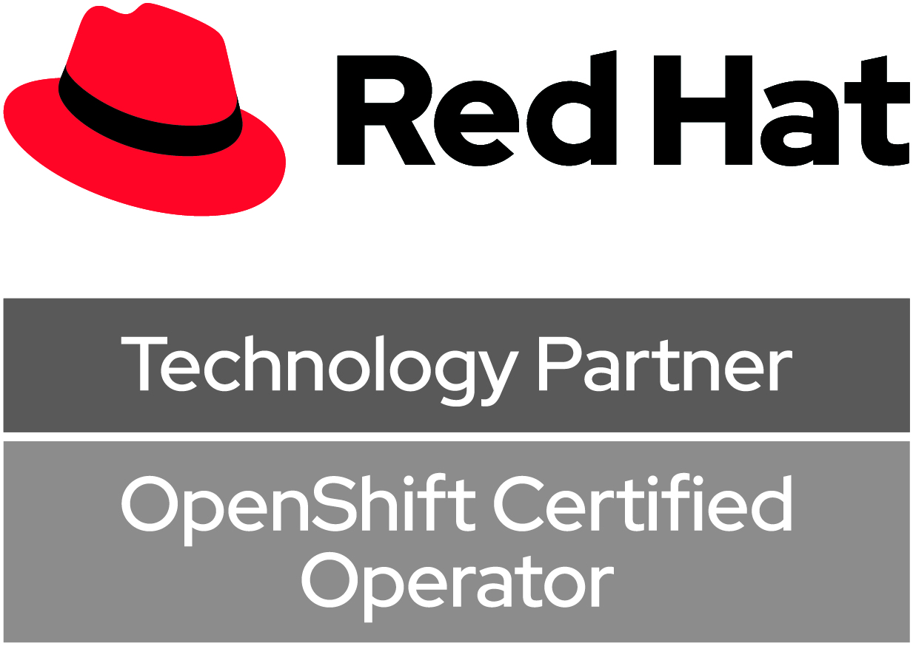

<b>Operators</b> are the most Kubernetes-native way of managing the lifecycle of applications. They are purpose-built to run a Kubernetes application with operational knowledge baked in, making them smarter and more tailored than generic automation tools.
 

## Aqua for Red Hat Marketplace

Aqua’s OpenShift-certified Operator can successfully handle the scale of large enterprise deployments and provides a consistent experience across a broad range of applications, spanning both private and public clouds.

<table>
	<tr>
		<td></td>
	</tr>
</table>

## Step 1: Subscribe on the Red Hat Marketplace
<table>
	<tr>
		<td width="40%"></td>
		<td>
			<h3>Aqua platform on Red Hat Marketplace</h3>
			
As a Red Hat technology partner, Aqua platform provides the most complete security solutions to protect workloads running on Red Hat OpenShift. You can choose to purchase an <b>annual contract</b> with us to unlock enterprise features and custom configurations or leverage our <b>30-day Free Trial</b> to unleash all of Aqua’s capabilities across unlimited nodes.
			

			

		</td>
	</tr> 
</table>

## Step 2: Launch Aqua enterprise platform using Red Hat-certified OpenShift operator
<table>
	<tr>
		<td width="40%"></td>
		<td>
			<h3>Configuration of Red Hat-certified Aqua operator</h3>
			
 Register your OpenShift cluster with Red Hat marketplace. The only pre-requisite for the deployment is having an <b>aqua</b> project created on the cluster, and leverage the Aqua Operator for easy-button deployments. 

			

		</td>
	</tr>
</table>

## Step 3: Launch Aqua console
Please note the Aqua console URL from the OpenShift console. If you created an OpenShift Route, then navigate to the Routes tab and open it up in your favorite browser.
<table>
	<tr>
		<td><h3>Image showing Aqua console</h3></td>
	</tr>
</table>

If you already have one, input the Aqua license or obtain the license by simply reaching out to us at [cloudsales@aquasec.com](mailto:cloudsales@aquasec.com) and we’ll create one for you.  

Check out the video to learn how to deploy Aqua Enterprise platform on an OpenShift cluster via the Red Hat marketplace, by leveraging the Aqua operator.

  

---
Visit [aquasec.com](https://www.aquasec.com/) to learn more.